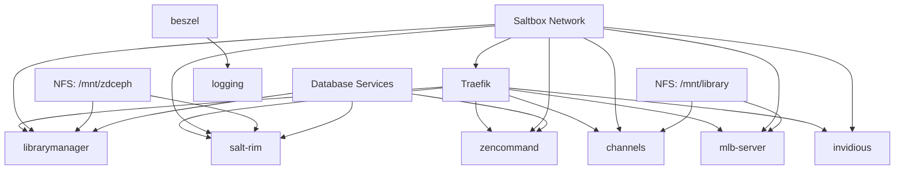
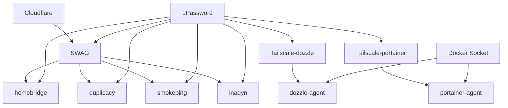
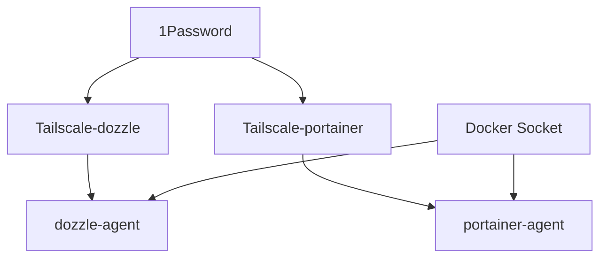

# CLAUDE.md

This file provides guidance to Claude Code (claude.ai/code) when working with code in this repository.

## Centralized Docker Compose Workflow Management

This repository contains **reusable GitHub Actions workflows** that provide centralized CI/CD automation for multiple Docker Compose environments. The goal is to eliminate code duplication while maintaining environment-specific configurations.

### Repository Purpose

**compose-workflow** serves as a centralized workflow hub for:
- **docker-zendc** - Data center services (media stack, custom apps, monitoring)  
- **docker-piwine** - Main Raspberry Pi services (networking, backup, smart home)
- **docker-piwine-office** - Office Raspberry Pi services (minimal monitoring stack)

Each target repository calls these workflows with environment-specific parameters, reducing maintenance overhead and ensuring consistency.

### Workflow Architecture

This repository provides two main reusable workflows:

#### 1. Lint Workflow (`/.github/workflows/lint.yml`)
- **Purpose**: Validates Docker Compose files and detects secrets
- **Features**: GitGuardian scanning, YAML linting, Docker Compose validation
- **Input Parameters**: 
  - `stacks`: JSON array of stack names to lint
  - `webhook-url`: 1Password reference to Discord webhook
  - `repo-name`: Repository name for notifications

#### 2. Deploy Workflow (`/.github/workflows/deploy.yml`)  
- **Purpose**: Handles deployment, health checks, rollback, and cleanup
- **Features**: Parallel deployment, Tailscale integration, Discord notifications
- **Input Parameters**:
  - `args`: Docker Compose up arguments
  - `stacks`: JSON array of stack names to deploy
  - `webhook-url`: 1Password reference to Discord webhook  
  - `repo-name`: Repository name for notifications
  - `has-dockge`: Boolean for Dockge restart requirement

### Target Repository Integration

Each target repository integrates via **evaluation workflows** that demonstrate usage:

```yaml
# Example: docker-zendc/.github/workflows/deploy-evaluation.yml
name: Deploy Docker Compose (Evaluation)

on:
  workflow_dispatch:
    inputs:
      evaluate:
        description: "Set to 'true' to enable this evaluation workflow"
        required: true
        type: choice
        default: 'false'

jobs:
  discover-stacks:
    runs-on: ubuntu-latest
    if: ${{ inputs.evaluate == 'true' }}
    outputs:
      stacks: ${{ steps.find-stacks.outputs.stacks }}
    steps:
      - uses: actions/checkout@v4
      - name: Find Docker Compose stacks
        id: find-stacks
        run: |
          stacks=()
          for dir in */; do
            if [[ -f "$dir/compose.yml" || -f "$dir/compose.yaml" ]]; then
              stacks+=("\"$(basename "$dir")\"")
            fi
          done
          stack_json="[$(IFS=,; echo "${stacks[*]}")]"
          echo "stacks=$stack_json" >> $GITHUB_OUTPUT

  deploy:
    needs: discover-stacks
    uses: owine/compose-workflow/.github/workflows/deploy.yml@main
    secrets: inherit
    with:
      stacks: ${{ needs.discover-stacks.outputs.stacks }}
      webhook-url: "op://Docker/discord-github-notifications/zendc_webhook_url"
      repo-name: "docker-zendc"
      has-dockge: false
```

### Benefits of Centralization

1. **Reduced Duplication**: Single workflow definitions shared across repositories
2. **Dynamic Stack Discovery**: Automatically detects Docker Compose files
3. **Consistent Behavior**: Standardized deployment patterns and error handling  
4. **Centralized Maintenance**: Updates apply to all environments simultaneously
5. **Environment-Specific Configuration**: Parameterized workflows adapt to each environment
6. **Safe Evaluation**: Evaluation workflows demonstrate usage without accidental triggers

## Architecture Overview

### Environment-Specific Patterns

#### docker-zendc (Data Center)

- **Purpose**: High-performance media services and custom applications
- **Infrastructure**: Traefik reverse proxy with extensive middleware chains
- **Key Services**:
  - Media stack (channels, mlb-server, invidious)
  - Custom apps (librarymanager, salt-rim, zencommand)
  - Monitoring (beszel, logging stack)
- **Networking**: Saltbox network integration, complex Traefik routing
- **Storage**: NFS mounts (`/mnt/library`, `/mnt/zdceph`) for large media files

#### docker-piwine (Main Pi)

- **Purpose**: Core infrastructure and smart home services
- **Infrastructure**: SWAG reverse proxy with Cloudflare integration
- **Key Services**:
  - Network services (inadyn DDNS, smokeping monitoring)
  - Smart home (homebridge for HomeKit)
  - Backup (duplicacy for data protection)
  - Remote access (dozzle, portainer via Tailscale)
- **Networking**: Tailscale sidecars for secure remote access
- **Security**: Zero-trust networking model

#### docker-piwine-office (Office Pi)

- **Purpose**: Minimal monitoring for office environment
- **Key Services**: dozzle and portainer agents via Tailscale
- **Networking**: Simple Tailscale-only architecture

### Common Infrastructure Patterns

#### Secret Management

All environments use 1Password Connect for secret injection:
```env
VARIABLE_NAME="op://Vault/Item/field"
```

- Secrets are never committed to repositories
- GitGuardian scanning prevents accidental secret commits
- Runtime secret injection via 1Password service accounts

#### Container Image Management

- **SHA256 Pinning**: All images use specific digests for reproducibility
- **Watchtower Integration**: Selective auto-updates with labels
- **Registry Strategy**: Mix of Docker Hub, LSCR, GHCR, and private registries

#### Traefik vs SWAG Routing

**docker-zendc (Traefik)**:
```yaml
labels:
  traefik.enable: true
  traefik.http.routers.service.rule: Host(`service.${DOMAIN}`)
  traefik.http.routers.service.middlewares: globalHeaders@file,secureHeaders@file
```

**docker-piwine (SWAG)**:
```yaml
labels:
  swag: enable
  swag_auth: authelia  # Optional authentication
```

## Development Commands

### Centralized Workflow Development

```bash
# Work in compose-workflow repository
cd compose-workflow

# Test workflow syntax
actionlint .github/workflows/lint.yml
actionlint .github/workflows/deploy.yml

# Validate workflow parameters
yamllint --strict .github/workflows/lint.yml
yamllint --strict .github/workflows/deploy.yml
```

### Target Repository Operations

```bash
# Work in specific environment (for evaluation workflow testing)
cd docker-zendc    # or docker-piwine, docker-piwine-office

# Test dynamic stack discovery locally
stacks=()
for dir in */; do
  dir_name=$(basename "$dir")
  if [[ -f "$dir/compose.yml" || -f "$dir/compose.yaml" ]]; then
    stacks+=("\"$dir_name\"")
  fi
done
stack_json="[$(IFS=,; echo "${stacks[*]}")]"
echo "Discovered stacks: $stack_json"

# Validate evaluation workflows
actionlint .github/workflows/*-evaluation.yml
```

### Environment-Specific Commands

#### docker-zendc Services

```bash
# Matrix services for CI: barassistant, beszel, logging, media, services, zencommand
for stack in barassistant beszel logging media services zencommand; do
  echo "Validating $stack"
  yamllint --strict --config-file .yamllint $stack/compose.yaml
  docker compose -f $stack/compose.yaml config
done
```

#### docker-piwine Services

```bash
# Matrix services for CI: dozzle, homebridge, portainer, services, swag
for stack in dozzle homebridge portainer services swag; do
  echo "Validating $stack"
  yamllint --strict --config-file .yamllint $stack/compose.yaml
  docker compose -f $stack/compose.yaml config
done
```

#### docker-piwine-office Services

```bash
# Matrix services for CI: dozzle, portainer
for stack in dozzle portainer; do
  echo "Validating $stack"
  yamllint --strict --config-file .yamllint $stack/compose.yaml
  docker compose -f $stack/compose.yaml config
done
```

### Deployment Commands

```bash
# Deploy service with proper environment file
docker compose -f <service>/compose.yaml --env-file compose.env up -d

# View logs
docker compose -f <service>/compose.yaml logs -f [service_name]

# Validate configuration without deploying
docker compose -f <service>/compose.yaml --env-file compose.env config
```

## Linting and Validation

### YAML Linting Configuration

All repositories share consistent `.yamllint` configuration:

```yaml
extends: default
rules:
  line-length: disable      # Long Docker image URLs
  document-start: disable   # Docker Compose doesn't require ---
```

### CI/CD Pipeline Structure

The centralized workflows provide consistent pipeline stages:

#### Lint Pipeline (`lint.yml`)
1. **GitGuardian Scanning** - Secret detection with 1Password integration
2. **YAML Linting** - Validates compose file formatting using yamllint  
3. **Docker Compose Config** - Validates syntax and configuration
4. **Matrix Strategy** - Tests each service independently
5. **Discord Notifications** - Reports results with 1Password webhook integration

#### Deploy Pipeline (`deploy.yml`)
1. **Preparation** - Checkout, 1Password setup, Tailscale connection
2. **Parallel Deployment** - Deploy all stacks concurrently with proper logging
3. **Health Checks** - Verify all services are running and healthy
4. **Cleanup** - Remove old containers and images (optional)
5. **Rollback** - Automatic rollback on failure with previous commit restoration
6. **Discord Notifications** - Comprehensive deployment status reporting

#### Evaluation Workflows (Target Repositories)
1. **Stack Discovery** - Dynamic detection of Docker Compose files
2. **Reusable Workflow Call** - Invokes centralized workflow with parameters
3. **Safe Execution** - Manual trigger with explicit confirmation required

## Security Architecture

### Network Security Models

#### Tailscale Zero-Trust (Pi Environments)

Services use Tailscale sidecars for secure remote access:

```yaml
tailscale-service:
  image: tailscale/tailscale:latest
  environment:
    - TS_AUTHKEY=${SERVICE_TS_AUTHKEY}
    - TS_HOSTNAME=${HOSTNAME}-service
  healthcheck:
    test: tailscale status --json --active
main-service:
  depends_on:
    tailscale-service:
      condition: service_healthy
  network_mode: service:tailscale-service
```

#### Traefik Middleware Chains (Data Center)

Complex security middleware for public-facing services:

- `globalHeaders@file` - Security headers
- `secureHeaders@file` - Additional security headers  
- `cloudflarewarp@docker` - Cloudflare integration
- `crowdsec@docker` - Intrusion prevention
- `authelia@docker` - Authentication (when required)

### Secret Management Best Practices

- All secrets use 1Password references (`op://...`)
- Environment-specific vaults (zendc-*, piwine-*, piwine-office-*)
- Service account tokens for CI/CD secret access
- Never commit actual secret values

## Common Maintenance Tasks

### Adding New Services

#### In Target Repositories (docker-zendc, docker-piwine, docker-piwine-office)

1. Create service directory with `compose.yaml` or `compose.yml`
2. Define environment variables in `compose.env`
3. Choose appropriate networking (Traefik labels vs SWAG labels vs Tailscale)
4. Pin image to SHA256 digest
5. Test validation commands
6. **No workflow updates needed** - dynamic discovery automatically includes new services

#### In Centralized Workflow Repository (compose-workflow)

1. **Update reusable workflows** - Modify `.github/workflows/lint.yml` or `deploy.yml` for new features
2. **Update documentation** - Reflect changes in `README.md` and `CLAUDE.md`
3. **Version workflows** - Consider using tags for major workflow changes
4. **Test with evaluation workflows** - Verify changes work across all target repositories

### Cross-Environment Updates

#### Centralized Workflow Updates

When updating reusable workflows:

1. **Update workflows** - Make changes in compose-workflow repository
2. **Test with evaluation workflows** - Use evaluation workflows in target repositories to test changes
3. **Version if needed** - Consider tagging releases for major workflow changes: `@v1.0.0`
4. **Update all references** - Target repositories automatically use `@main` unless pinned to specific versions

#### Target Repository Updates

When updating target repository configurations:

1. **Apply changes per environment** - Each repository maintains its own configuration
2. **Use consistent patterns** - Follow established patterns for new services
3. **Test evaluation workflows** - Verify changes work with centralized workflows
4. **No cross-repository sync needed** - Each environment operates independently

### Image Updates

```bash
# Get image digest for pinning
docker pull image:tag
docker inspect image:tag --format='{{index .RepoDigests 0}}'
# Use full sha256 reference in compose.yaml
```

### Environment Variable Management

- Group related variables by service in compose.env
- Use descriptive 1Password vault/item names
- Document any cross-service dependencies
- Test secret resolution before deploying

## Centralized Configuration Management

### Configuration Validator Script

A centralized validation script is available to check consistency across all environments:

```bash
# Validate all environments
./scripts/validate-config.sh

# Validate specific environment  
./scripts/validate-config.sh docker-zendc
./scripts/validate-config.sh docker-piwine
./scripts/validate-config.sh docker-piwine-office

# Show help
./scripts/validate-config.sh --help
```

The validator checks:
- 1Password reference format and vault consistency
- Environment variable completeness
- Docker Compose file syntax and structure  
- Service dependencies and networking
- SHA256 image pinning compliance
- Cross-environment configuration consistency

### Common Configuration

Shared settings are defined in `config/common-config.yaml`:
- Environment-specific validation rules
- Required services and dependencies
- Networking and security requirements
- CI/CD pipeline configuration
- Resource limits and monitoring guidelines

## Troubleshooting Guide

### Common Issues and Solutions

#### Tailscale Connectivity Problems

**Symptoms**: Services unreachable via Tailscale, authentication failures

**Diagnosis**:

```bash
# Check Tailscale service health
docker compose -f dozzle/compose.yaml exec tailscale-dozzle-agent tailscale status

# Check auth key validity
docker compose -f dozzle/compose.yaml logs tailscale-dozzle-agent

# Verify network mode connectivity
docker compose -f dozzle/compose.yaml exec dozzle-agent wget -O- http://localhost:8080/api/health
```

**Solutions**:
1. **Auth Key Expired**: Update `*_TS_AUTHKEY` in 1Password and redeploy
2. **Network Issues**: Restart Tailscale sidecar: `docker compose restart tailscale-service`
3. **Health Check Failing**: Check Tailscale daemon status and logs
4. **Tag Permissions**: Verify Tailscale ACL allows advertised tags

#### 1Password Secret Resolution Failures

**Symptoms**: Container startup failures, "secret not found" errors

**Diagnosis**:

```bash
# Test 1Password connectivity (requires op CLI)
op vault list
op item get "item-name" --vault="vault-name"

# Check service account permissions in 1Password
# Validate environment file format
./scripts/validate-config.sh docker-piwine | grep -i "password\|secret"
```

**Solutions**:
1. **Invalid Format**: Ensure format is `"op://Vault/Item/field"`
2. **Access Denied**: Check 1Password service account permissions
3. **Wrong Vault**: Verify vault name matches environment (zendc vs piwine)
4. **Network Issues**: Check 1Password Connect server connectivity

#### Container Startup Dependency Issues

**Symptoms**: Services fail to start, dependency timeout errors

**Diagnosis**:

```bash
# Check service startup order
docker compose -f service/compose.yaml config | grep -A5 -B5 depends_on

# Monitor dependency health checks
docker compose -f service/compose.yaml ps
docker compose -f service/compose.yaml logs dependency-service

# Check network connectivity between containers
docker compose -f service/compose.yaml exec main-service ping dependency-service
```

**Solutions**:
1. **Health Check Timeout**: Increase health check intervals/retries
2. **Slow Startup**: Add `start_period` to health check configuration
3. **Network Issues**: Verify containers are on same network
4. **Resource Constraints**: Check memory/CPU limits

#### Reverse Proxy Configuration Issues

**SWAG (docker-piwine)**:

```bash
# Check SWAG container logs
docker compose -f swag/compose.yaml logs swag

# Verify SSL certificate status  
docker compose -f swag/compose.yaml exec swag ls -la /config/keys/

# Test internal service connectivity
docker compose -f swag/compose.yaml exec swag wget -O- http://service-name:port/
```

**Traefik (docker-zendc)**:

```bash
# Check Traefik dashboard (if enabled)
curl -s http://traefik.domain.com/api/rawdata | jq '.routers'

# Verify service labels
docker compose -f service/compose.yaml config | grep -i traefik

# Check middleware configuration
docker inspect traefik_container | jq '.[0].Config.Labels'
```

#### Performance and Resource Issues

**Symptoms**: Slow response times, container restarts, memory errors

**Diagnosis**:

```bash
# Check resource usage
docker stats --no-stream

# Monitor container restarts
docker compose -f service/compose.yaml ps

# Check system resources (Pi environments)
htop
df -h
free -h
```

**Solutions**:
1. **Memory Limits**: Increase memory limits or add swap
2. **CPU Throttling**: Adjust CPU limits or service priorities
3. **Disk Space**: Clean up logs, images, volumes
4. **Network Latency**: Check Tailscale connection quality

## Service Dependencies Map

### docker-zendc (Data Center)



**Critical Dependencies**:
- **Traefik** → All web services (reverse proxy)
- **Saltbox Network** → All services (container networking)
- **NFS Mounts** → Media services (storage)
- **Database Services** → Custom applications

### docker-piwine (Main Pi)



**Critical Dependencies**:
- **SWAG** → Web services (reverse proxy + SSL)
- **Tailscale Sidecars** → Remote access services
- **1Password** → All services (secrets management)
- **Cloudflare** → SWAG (DNS + certificates)

### docker-piwine-office (Office Pi)



**Critical Dependencies**:
- **Tailscale Sidecars** → All services (networking)
- **1Password** → All services (secrets)
- **Docker Socket** → Monitoring services

## Recovery Procedures

### Service Recovery Steps

#### Standard Recovery Process

1. **Check Service Health**:

```bash
# Check container status
docker compose -f service/compose.yaml ps

# Check resource usage
docker stats container-name --no-stream

# Review recent logs
docker compose -f service/compose.yaml logs --tail=50 service-name
```

2. **Validate Environment Variables**:

```bash
# Run configuration validator
./scripts/validate-config.sh environment-name

# Check 1Password connectivity
op item get item-name --vault=vault-name --fields=field-name
```

3. **Review Container Logs**:

```bash
# Full service logs
docker compose -f service/compose.yaml logs service-name

# Follow live logs
docker compose -f service/compose.yaml logs -f service-name

# System journal (if needed)
sudo journalctl -u docker.service --since "1 hour ago"
```

4. **Restart Dependent Services**:

```bash
# Restart single service
docker compose -f service/compose.yaml restart service-name

# Restart with dependencies
docker compose -f service/compose.yaml up -d --force-recreate service-name

# Full stack restart (if needed)
docker compose -f service/compose.yaml down && docker compose -f service/compose.yaml up -d
```

#### Environment-Specific Recovery

**docker-zendc Recovery**:

```bash
# Check Traefik status
docker inspect traefik_container_name
curl -f http://traefik.domain.com/ping

# Verify NFS mounts
ls -la /mnt/library /mnt/zdceph
mount | grep nfs

# Database connectivity test
docker compose -f service/compose.yaml exec service-name pg_isready -h db-host
```

**docker-piwine Recovery**:

```bash
# SWAG health check
docker compose -f swag/compose.yaml exec swag nginx -t
curl -f https://domain.com/

# Tailscale connectivity test
docker compose -f service/compose.yaml exec tailscale-service tailscale ping hostname

# Cloudflare DNS check
nslookup domain.com 1.1.1.1
```

**docker-piwine-office Recovery**:

```bash
# Basic connectivity test
docker compose -f dozzle/compose.yaml exec tailscale-dozzle-agent tailscale status
docker compose -f portainer/compose.yaml exec tailscale-portainer-agent tailscale status
```

#### Disaster Recovery Procedures

**Full Environment Recovery**:

1. **Backup Current State**:

```bash
# Export configurations
docker compose -f */compose.yaml config > backup-configs.yaml

# Backup volumes (if applicable)
docker run --rm -v volume_name:/data -v $PWD:/backup alpine tar czf /backup/volume-backup.tar.gz -C /data .
```

2. **Clean Slate Recovery**:

```bash
# Stop all services
for service in */; do docker compose -f $service/compose.yaml down; done

# Clean up containers and networks
docker system prune -a --volumes

# Redeploy from clean state
for service in */; do docker compose -f $service/compose.yaml up -d; done
```

3. **Verify Recovery**:

```bash
# Run full validation
./scripts/validate-config.sh all

# Test all service endpoints
curl -f https://service1.domain.com/health
curl -f https://service2.domain.com/health
```

## Performance Monitoring

### Key Metrics to Monitor

#### System-Level Metrics

**Raspberry Pi Environments**:

```bash
# CPU and memory usage
htop
free -h

# Disk usage and I/O
df -h
iotop

# Network interface statistics
ip -s link show
ss -tuln
```

**Data Center Environment**:

```bash  
# Resource utilization
top
iostat 5
vmstat 5

# Network performance
iftop -i eth0
nethogs
```

#### Container-Level Metrics

```bash
# Real-time container stats
docker stats

# Container resource limits vs usage  
docker inspect container-name | jq '.[0].HostConfig | {Memory, CpuShares, CpuPeriod, CpuQuota}'

# Container health status
docker inspect container-name | jq '.[0].State.Health'

# Volume usage
docker system df -v
```

#### Service-Level Metrics

**Web Services Response Times**:

```bash
# HTTP response time testing
curl -o /dev/null -s -w "Time: %{time_total}s\nSize: %{size_download}\nSpeed: %{speed_download}\n" https://service.domain.com

# Tailscale latency testing
docker compose -f service/compose.yaml exec tailscale-service tailscale ping --until-direct hostname
```

**Database Performance** (docker-zendc):

```bash
# PostgreSQL connection testing
docker compose -f service/compose.yaml exec db-service pg_isready

# Query performance
docker compose -f service/compose.yaml exec db-service psql -c "SELECT pg_stat_activity;"
```

#### Network Monitoring

**Tailscale Network Quality**:

```bash
# Network status and performance
tailscale status
tailscale netcheck

# Connection quality to specific nodes
tailscale ping hostname
```

**Reverse Proxy Performance**:

```bash
# SWAG access log analysis
docker compose -f swag/compose.yaml exec swag tail -f /config/log/nginx/access.log

# Response time distribution
docker compose -f swag/compose.yaml exec swag awk '{print $NF}' /config/log/nginx/access.log | sort -n | uniq -c
```

### Performance Optimization Guidelines

#### Resource Allocation

**Raspberry Pi Limits**:

```yaml
# Recommended resource limits for Pi services
resources:
  limits:
    memory: 256m
    cpus: '0.5'
  reservations:  
    memory: 128m
    cpus: '0.25'
```

**Data Center Services**:

```yaml
# Higher limits for datacenter services
resources:
  limits:
    memory: 2g
    cpus: '2.0'
  reservations:
    memory: 1g  
    cpus: '1.0'
```

#### Optimization Checklist

1. **Image Optimization**:
   - Use Alpine-based images where possible
   - Multi-stage builds for custom images
   - Regular image cleanup: `docker image prune -a`

2. **Volume Management**:
   - Use bind mounts for configuration
   - Named volumes for persistent data
   - Regular cleanup: `docker volume prune`

3. **Network Optimization**:
   - Minimize cross-host network traffic
   - Use local networking where possible
   - Monitor Tailscale overhead

4. **Logging Strategy**:
   - Configure log rotation
   - Use structured logging
   - Centralize logs where beneficial
